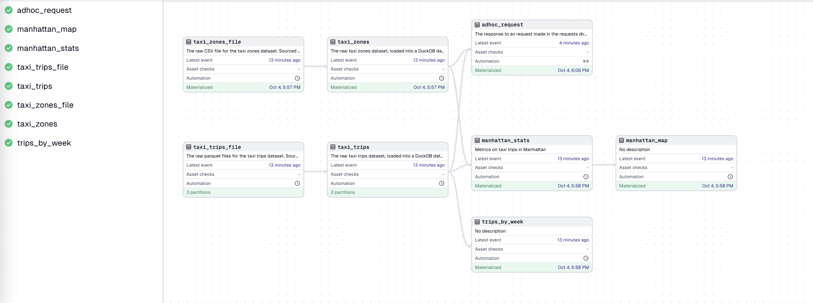
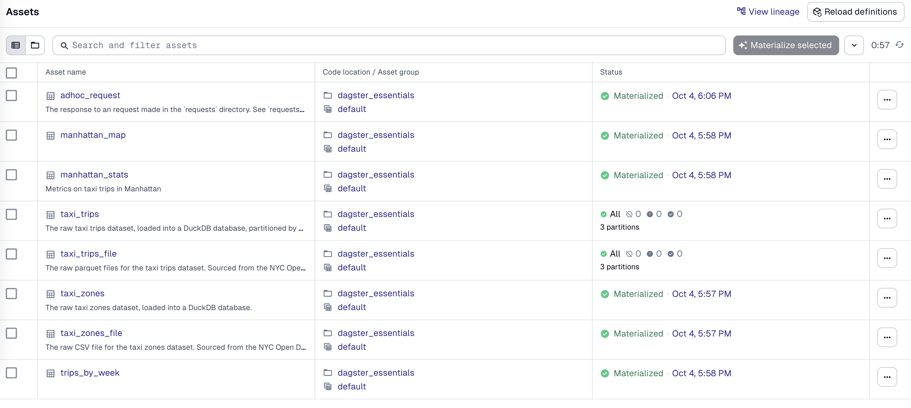
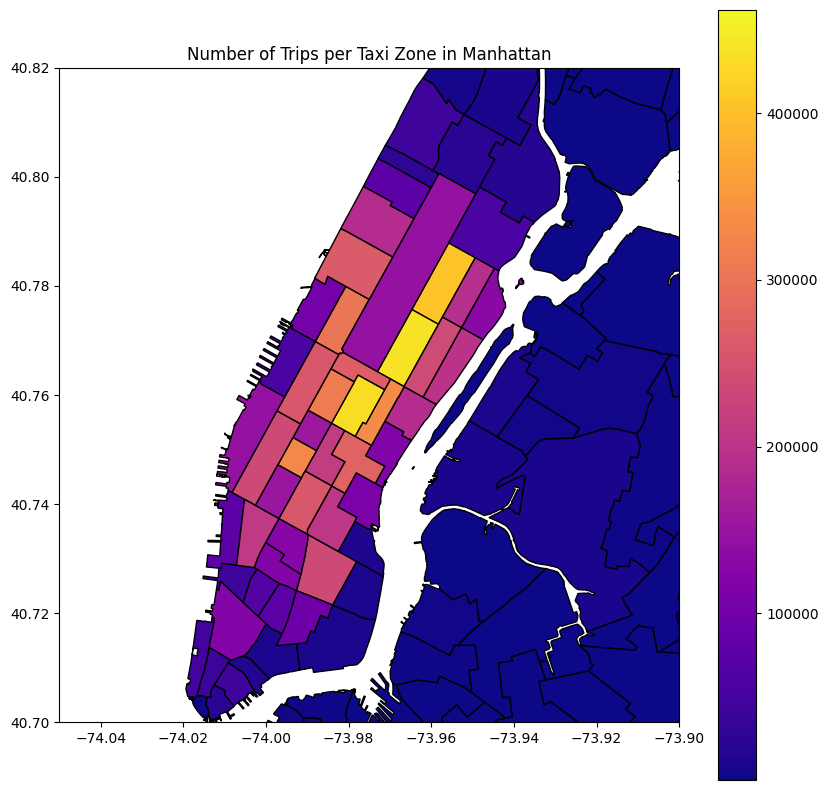
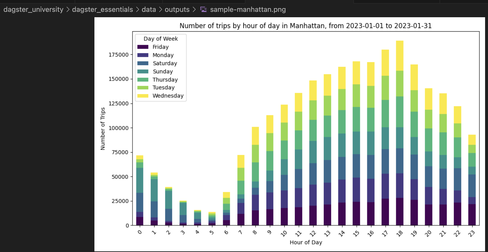
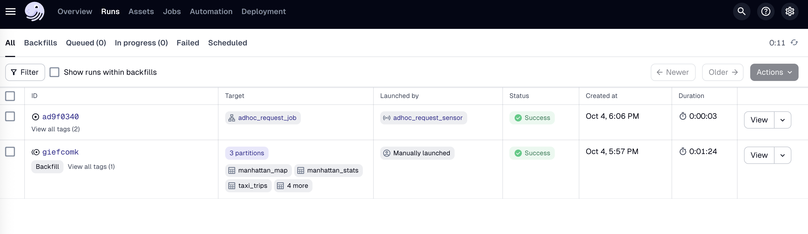

# NYC Taxi Data Pipeline

A data pipeline built with Dagster for analyzing NYC taxi trip data, demonstrating modern data engineering practices including asset-based architecture, partitioning, and automated scheduling.

**Tech Stack:** Python, Dagster, DuckDB, GeoPandas, Matplotlib  
**Dataset:** 9.4M+ NYC taxi trip records (2023)

## Pipeline Architecture

The pipeline follows a layered architecture with automated data ingestion, processing, and analytics generation:

- **Ingestion:** Automated download of NYC taxi data (monthly partitions)
- **Processing:** Data transformation and loading into DuckDB
- **Analytics:** Geographic analysis and visualization generation
- **Scheduling:** Automated monthly refreshes and ad-hoc request processing

## Key Features

- **Time-based Partitioning:** Monthly data partitions for efficient processing
- **Automated Scheduling:** Monthly data refreshes and weekly analytics
- **Event-driven Processing:** File-based sensors for ad-hoc analysis requests
- **Geographic Analysis:** NYC taxi zone mapping and visualization
- **Resource Management:** DuckDB connection pooling and error handling

## Results

The pipeline generates automated analytics including geographic heatmaps, temporal analysis, and configurable reports:

## Pipeline Execution

## Technical Implementation

**Data Engineering Concepts Demonstrated:**
- Asset-based pipeline architecture
- Time-based data partitioning
- Automated scheduling and monitoring  
- Event-driven processing with sensors
- Geographic data analysis and visualization
